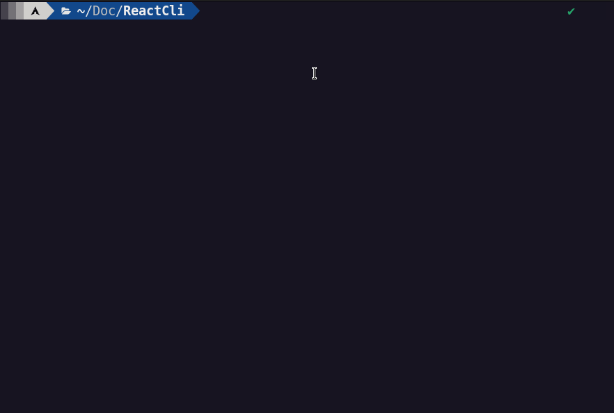
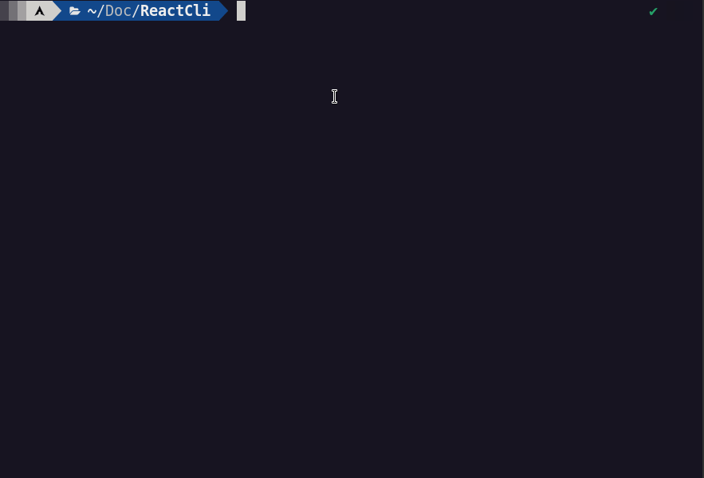

<p align="center">  </p>

<h1 align="center">React Component - CLI</h1> 
<p align="center">
• <a href="#-about">About</a> •
 <a href="#-tools">Tools</a> •
 <a href="#-how-to-run">How to run</a> • 
  <a href="#-preview">Preview</a> •
 <a href="#user-content--license">License</a> •
 <a href="#-language">Languages</a> •
</p>

---

## About
Simple code generator, its objective is to generate a react component according to the parameters in the cli</br>
by default the generator already creates the component, style and test. But you can tell him what you want to create.

> Cli parameters 
```
  -n : Component name ==> string ==> [default = ComponentName]
  -c : Create component ==> options y ou n |==> [default = y]
  -s : Create style ==> options y ou n |==> [default = y]
  -t : Create test ==> options y ou n |==> [default = y]
  -p : Indicates where the component should be created ==> string ==> [default = './']
```

---

## Tools
- Python


---

## How to run
**Just do the following steps...**

- Have python3 installed on the machine:

- And to run the project, you can do it in two ways:

  - 1 ---> No alias
  ```
    -n : Component name ==> string ==> [default = ComponentName]
    python __main__.py |==> Create the component named ComponentName 
    python __main__.py -n ComponenteReact123 |==> Create the component named ComponenteReact123

    -c : Create componente ==> Options y ou n |==> [default = y]
    python __main__.py -c y |==> Create the componente 
    python __main__.py -c n |==> Don't create the component 

    -s : Create style ==> Options y ou n |==> [default = y]
    python __main__.py -s y |==> Create the style 
    python __main__.py -s n |==> Don't create the style 

    -t : Create test ==> Options y ou n |==> [default = y]
    python __main__.py -t y |==> Create the test 
    python __main__.py -t n |==> Don't create the test 

    -p : Indicates where the component should be created ==> string ==> [default = './']
    python __main__.py -p |==> Creates the component at the root of where the project is. ==> ex.: /home/user
    python __main__.py -p ./home/user/documents/MyReactProject/src/components |==> Create the component inside the "MyReactProject inside the src folder -> componentes"

    *********************************************************************
    * There is a better way to do this path. // I explain further below *
    *********************************************************************

  ```
  ### **Recommended method**
  2 ---> With alias <br/>
  Step to step.

  - Create a linux alias for the project.
  - When used Bash --- nano .bashrc | or | Zsh --- nano .zshrc
  - Paste command <br/>
    ```
      alias NAME_PREFFER="python PROJECT_PATH"

      ex: 

      alias reactcli="python /home/user/react-component-cli"
    ``` 


---

## Preview

<p align="center">  </p>

**<p align="center">Demonstration.</p>**
<br/>

<p align="center">  </p>

**<p align="center">Creating component inside subfolders.</p>**

---

## License

This project is under license[MIT](./LICENSE).

Made with ❤️ by Alan Neres 👋🏽 [Contact me!](https://www.linkedin.com/in/alan-neres/)

---

## Language
[🇧🇷 Portuguese | pt-BR](./README.md)

---

## Still in development (TODO)
- N/A