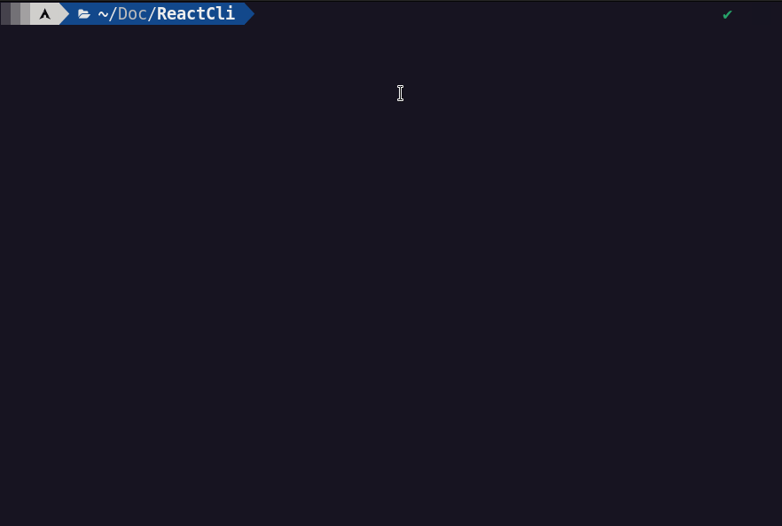

<p align="center">  </p>

<h1 align="center">React Component - CLI</h1> 
<p align="center">
• <a href="#-sobre-o-projeto">Sobre</a> •
 <a href="#-ferramentas">Ferramentas</a> •
 <a href="#-como-executar-o-projeto">Como executar</a> • 
  <a href="#-visualização">Visualização</a> •
 <a href="#user-content--licença">Licença</a> •
 <a href="#-linguagens">Linguagens</a> •
</p>

---

## 💻 Sobre o projeto
Simples gerador de código, o objetivo dele é gerar um componente react conforme os parametros na cli</br>
por padrão o gerador já cria o componente, estilo e o teste. Porém você pode dizer a ele o que você quer criar.

> Parâmetros da cli  
```
  -n : Nome do componente ==> string ==> [default = ComponentName]
  -c : Criar componente ==> Opções y ou n |==> [default = y]
  -s : Criar Estilo ==> Opções y ou n |==> [default = y]
  -t : Criar Teste ==> Opções y ou n |==> [default = y]
  -p : Indica onde deve ser criado o componente ==> string ==> [default = './']
```

---

## 🛠 Ferramentas
- Python


---

## 🚀 Como executar o projeto
**Basta fazer os seguintes passos...**

- Ter o python3 instalado na máquina:

- E para rodar o projeto, você pode fazer de duas maneiras:

  - 1 ---> Sem alias
  ```
    -n : Nome do componente ==> string ==> [default = ComponentName]
    python __main__.py |==> Cria o componente com o nome ComponentName 
    python __main__.py -n ComponenteReact123 |==> Cria o componente com o nome ComponenteReact123

    -c : Criar componente ==> Opções y ou n |==> [default = y]
    python __main__.py -c y |==> Cria o componente 
    python __main__.py -c n |==> Não cria o componente 

    -s : Criar Estilo ==> Opções y ou n |==> [default = y]
    python __main__.py -s y |==> Cria o estilo 
    python __main__.py -s n |==> Não cria o estilo 

    -t : Criar Teste ==> Opções y ou n |==> [default = y]
    python __main__.py -t y |==> Cria o teste 
    python __main__.py -t n |==> Não cria o teste 

    -p : Indica onde deve ser criado o componente ==> string ==> [default = './']
    python __main__.py -p |==> Cria o componente na raiz de onde o projeto está. ==> ex.: /home/usuario
    python __main__.py -p ./home/usuario/documents/MeuProjetoReact/src/components |==> Cria o componente dentro do "MeuProjetoReact dentro da pasta src -> componentes"

    *********************************************************************
    * Existe um jeito melhor de fazer esse path. // Explico mais abaixo *
    *********************************************************************

  ```
  ### **Método recomendado**
  2 ---> Com alias <br/>
  Passo a passo.

  - Criar um alias no linux para o projeto.
  - Caso use Bash --- nano .bashrc | ou | Zsh --- nano .zshrc
  - Colar comando <br/>
    ```
      alias NOME_COMANDO_PREFERENCIA="python LOCAL_DO_PROJETO"

      ex: 

      alias reactcli="python /home/usuario/react-component-cli"
    ``` 


---

## 👀 Visualização

<p align="center">  </p>

**<p align="center">Demonstração.</p>**
<br/>

<p align="center">  </p>

**<p align="center">Criando componente dentro de sub-pastas.</p>**

---

## 📝 Licença

Este projeto esta sobe a licença [MIT](./LICENSE).

Feito com ❤️ por Alan Neres 👋🏽 [Entre em contato!](https://www.linkedin.com/in/alan-neres/)

---

## 🇧🇷 Linguagens
[🇺🇸 English](./README-en.md)

---

## 👨‍💻 Ainda em desenvolvimento (TODO)
- N/A